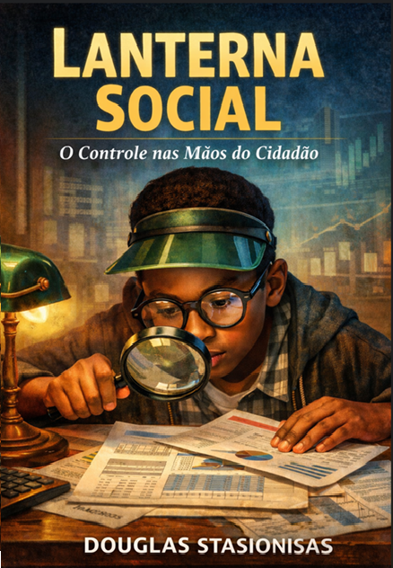
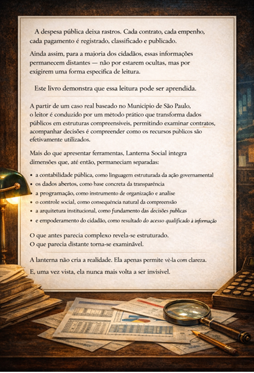

# Projeto_Lanterna_Social
Código- fonte e ferramentas de análise de dados do livro 'Lanterna Social - O Controle nas Mãos do Cidadão'

Este repositório contém o código-fonte, scripts Python e ferramentas de análise de dados apresentados no livro **Lanterna Social**. 

O objetivo deste projeto é empoderar cidadãos e auditores com ferramentas práticas para a fiscalização de gastos públicos, utilizando análise de dados e automação baseada na **Lei nº 14.133/2021**.

## 📖 Sobre o Livro
Este código é parte integrante do referido livro. Para entender a fundamentação legal e a lógica por trás de cada script, recomendamos sua consulta.

  
  

# 🔦 Projeto Lanterna Social
> "A lanterna não cria a realidade. Ela apenas permite vê-la com clareza. E, uma vez vista, ela nunca mais volta a ser invisível."

Este repositório é a extensão técnica e prática da obra **Lanterna Social: O Controle nas Mãos do Cidadão**. Aqui, os conceitos de contabilidade pública e auditoria transformam-se em ferramentas executáveis para a fiscalização cidadã.

### 🏛️ O Manifesto do Projeto
A despesa pública deixa rastros. Cada contrato, cada empenho e cada pagamento é registrado e publicado, mas essas informações muitas vezes permanecem distantes do cidadão comum por exigirem uma forma específica de leitura. 

Este projeto demonstra que **essa leitura pode ser aprendida**.

A partir de um caso real baseado no Município de São Paulo, o leitor é conduzido por um método prático que transforma dados brutos em estruturas compreensíveis, permitindo examinar contratos, acompanhar decisões e compreender a aplicação efetiva dos recursos públicos.

#### 🛠️ Integração de Dimensões
Mais do que scripts isolados, o **Projeto Lanterna Social** integra dimensões que historicamente permaneciam separadas:

* **Contabilidade Pública:** como linguagem estruturada da ação governamental.
* **Dados Abertos:** como base concreta da transparência.
* **Programação:** como instrumento de organização e análise.
* **Controle Social:** como consequência natural da compreensão.
* **Arquitetura Institucional:** como fundamento das decisões públicas.
* **Empoderamento do Cidadão:** como resultado do acesso qualificado à informação.

##### 🚀 Conteúdo do Repositório
Neste espaço, você encontrará os códigos em Python e os cadernos de análise (Jupyter Notebooks) utilizados no livro, incluindo:
1.  **Análise de Fracionamento:** Verificação de limites conforme a Lei nº 14.133/2021.
2.  **Consumo de APIs de Transparência:** Extração de dados reais de portais públicos.
3.  **Processamento de Dados Contábeis:** Scripts para triagem e classificação de despesas.

---
###### 📖 Sobre o Autor
**Douglas Stasionisas** é Analista de Planejamento e Desenvolvimento Organizacional (APDO) na especialidade de Ciências Contábeis e atua como contador público há praticamente três décadas. Este trabalho reflete sua missão de traduzir a complexidade técnica em transparência democrática. E contribuir como servidor publico e como contador público para o empoderamento social e para uma administração pública mais justa, transparente, eficiente, e menos sujeita aos riscos associados a práticas de fraudes ou corrupção. 

*Informações que antes parecia complexo reveLando-se estruturado, que pareciam distantes tornando-se acessível.*
